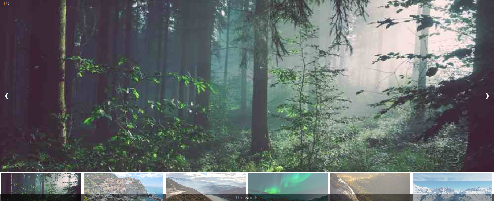

# react-image-galleries

React image galleries is a react component for building image galleries and carousels



## How to use it?

You can use the package in this way:

### Install

```bash
# with npm
npm install react-image-galleries

# with yarn
yarn add react-image-galleries
```

### Usage

- Import the package in your app:

```js
import ImageGallery from "react-image-galleries";

function App() {
  const data = [
    {
      id: 1,
      name: "The woods",
      path: "https://www.w3schools.com/howto/img_woods_wide.jpg",
    },
    {
      id: 2,
      name: "Cinque Terre",
      path: "https://www.w3schools.com/howto/img_5terre_wide.jpg",
    },
    {
      id: 3,
      name: "Mountains and fjords",
      path: "https://www.w3schools.com/howto/img_mountains_wide.jpg",
    },
    {
      id: 4,
      name: "Northern Lights",
      path: "https://www.w3schools.com/howto/img_lights_wide.jpg",
    },
    {
      id: 5,
      name: "Nature and sunrise",
      path: "https://www.w3schools.com/howto/img_nature_wide.jpg",
    },
    {
      id: 6,
      name: "Snowy Mountains",
      path: "https://www.w3schools.com/howto/img_snow_wide.jpg",
    },
  ];

  return (
    <div>
      <ImageGallery images={data} />
    </div>
  );
}
```

### Author

- [Mr. Thapa, Vishal](https://www.linkedin.com/in/vishal-thapa-7a6692141/)
